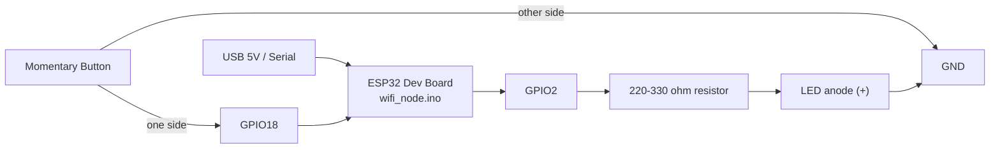
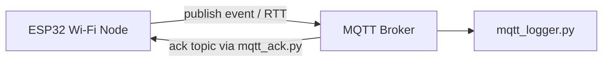

# WiFi Node Connection Diagram

This wiring matches [firmware/wifi_node/wifi_node.ino](../firmware/wifi_node/wifi_node.ino).

## Hardware Wiring

## Network Flow

## Pin Summary

| Sketch Constant | ESP32 Pin | Connect To | Notes |
| --- | --- | --- | --- |
| `BUTTON_PIN` | `GPIO18` | Momentary pushbutton to `GND` | Uses `INPUT_PULLUP`, so no external pull-up resistor is needed. |
| `LED_PIN` | `GPIO2` | LED anode through `220-330 ohm` resistor, LED cathode to `GND` | If your ESP32 board already has an onboard LED on GPIO2, an external LED is optional. |

## Notes

- `BUTTON_PIN` is configured as `INPUT_PULLUP`, so the button should read `LOW` when pressed.
- `LED_PIN` is driven `HIGH` while a button-triggered event is being published.
- Wi-Fi and MQTT credentials come from `firmware/secrets.h`.
- The sketch publishes to `iotbench/wifi/<node>/event`, waits for `iotbench/wifi/<node>/ack`, and publishes RTT data on `iotbench/wifi/<node>/rtt`.
